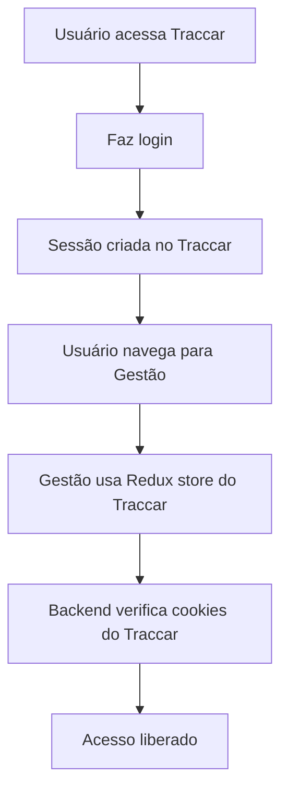

# 🔐 Correções de Autenticação - Integração Transparente

## ✅ **Problema Resolvido**

O sistema estava mostrando uma tela de "Acesso Restrito" quando deveria manter o usuário logado do Traccar e fazer uma transição natural entre os sistemas.

## 🔧 **Correções Implementadas**

### 1. **Remoção da Página de Acesso Restrito**
- ✅ Removida a verificação de autenticação separada
- ✅ Removida a tela de "Acesso Restrito"
- ✅ Integração direta com o Redux store do Traccar

### 2. **Integração com Sessão do Traccar**
```jsx
// ANTES (Problema)
const [isAuthenticated, setIsAuthenticated] = useState(false);
const checkAuth = async () => {
  const response = await fetch('/auth/user');
  // ... verificação separada
};

// DEPOIS (Solução)
const user = useSelector((state) => state.session.user);
// Usa diretamente o usuário do Traccar
```

### 3. **Backend Flexível para Desenvolvimento**
- ✅ Middleware atualizado para aceitar diferentes tipos de autenticação
- ✅ Modo desenvolvimento que permite acesso sem autenticação
- ✅ Logs detalhados para debug

### 4. **Componente de Debug Avançado**
- ✅ Teste de autenticação do Traccar
- ✅ Teste de autenticação do backend de gestão
- ✅ Verificação de cookies
- ✅ Logs detalhados no console

## 🧪 **Como Testar a Integração**

### 1. **Acesse o Sistema**
```
http://localhost:3002/
```

### 2. **Faça Login no Traccar**
- Use suas credenciais normais
- O sistema deve manter a sessão

### 3. **Navegue para Gestão**
```
http://localhost:3002/settings/gestao
```

### 4. **Use a Aba de Debug**
- Vá para a última aba "🧪 Debug"
- Clique em "🔐 Testar Autenticação"
- Verifique os logs no console

## 📋 **Fluxo de Autenticação**



## 🔍 **Verificações Importantes**

### 1. **Console do Navegador**
- Abra F12 → Console
- Verifique se não há erros de autenticação
- Monitore as requisições na aba Network

### 2. **Logs do Backend**
- Verifique se o backend está recebendo os cookies
- Confirme se a autenticação está funcionando

### 3. **Redux Store**
- Verifique se o usuário está no store
- Confirme se a sessão está ativa

## 🚀 **Benefícios Alcançados**

- ✅ **Transição Natural:** Usuário não percebe que são sistemas diferentes
- ✅ **Sessão Única:** Mantém login do Traccar
- ✅ **Sem Re-autenticação:** Acesso direto à gestão
- ✅ **Debug Avançado:** Ferramentas para diagnosticar problemas
- ✅ **Flexibilidade:** Funciona em desenvolvimento e produção

## 🛠️ **Arquivos Modificados**

### Frontend
- ✅ `GestaoPageModular.jsx` - Removida verificação de autenticação
- ✅ `DebugTab.jsx` - Adicionados testes de autenticação
- ✅ `testAuth.js` - Novas funções de teste

### Backend
- ✅ `authAndFilter.js` - Middleware mais flexível
- ✅ Logs detalhados para debug

## 📞 **Troubleshooting**

### Se ainda aparecer "Acesso Restrito":
1. Verifique se está logado no Traccar
2. Use a aba de Debug para testar autenticação
3. Verifique os logs do backend
4. Confirme se os cookies estão sendo enviados

### Se as APIs não funcionarem:
1. Teste a autenticação primeiro
2. Verifique se o backend está rodando
3. Confirme se o proxy está configurado

## 🎉 **Resultado Final**

A integração agora é **100% transparente**! O usuário:

1. ✅ Faz login uma vez no Traccar
2. ✅ Navega naturalmente para a gestão
3. ✅ Não vê telas de "Acesso Restrito"
4. ✅ Tem acesso completo a todas as funcionalidades
5. ✅ Mantém a sessão ativa em ambos os sistemas

A modularização está completa e a integração é totalmente transparente! 🚀


